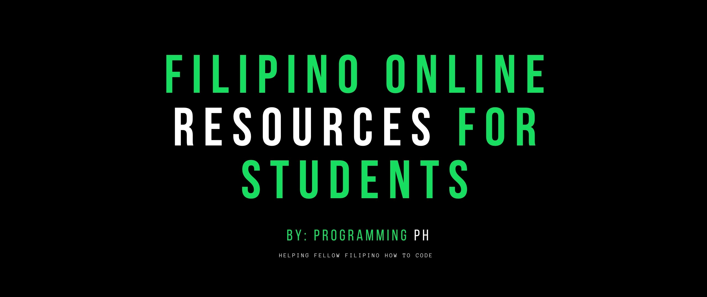

# Mga collection ng Tagalog Online Video Resources, Tutorials at iba pa para sa mga Filipino Students and aspiring programmers

If you are a College CS/IT student learning ng programming or experienced developer who needs additional resources, we prepared a carefully curated list of resources and tutorials to help each other.

# Table of Contents

1. [Coding Resources](#1-coding-resources)
	1. [Computer Science Fundamentals](#i-Computer-Science-Fundamentals)
          1. [Computers Basic](#Computer-Basic) (Absolute Beginners)
          2. [Programming Basic Fundamentals](#)
          3. [Programming Tips and Advise](#)

	2. [Web Development](#11-web-development)
	     1. [Front-End](#) 
	     2. [Back-End](#) *[pending]*
          3. [Full-stack](#) *[pending]*

	2. [Mobile App Development](#) *[pending]*
		1. [Android](#) *[pending]*
		2. [iOS](#) *[pending]*
		3. [Flutter](#) *[pending]*

	3. [Data Science](#11-python) *[pending]*
          1. [Data Science Fundamentals](#) *[pending]*
		2. [Business Intelligent Software](#) *[pending]*
		3. [Others](#) *[pending]*

	4. [Machine Learning](#12-machine-learning) *[pending]*

	5. [Programming Language](url) *[pending]*
		1. [Javascript/NodeJs](url) 
		2. [Python](url) *[pending]*
		3. [Java](url) *[pending]*
		4. [PHP](url) *[pending]*
		5. [C++](url) *[pending]*
		6. [Ruby](url) *[pending]*
		7. [Dart/Flutter](url) *[pending]*

	6. [Programming Skillset](url) *[pending]*
		1. [Project Management](url) *[pending]*
		2. [Programming Useful tools](url) *[pending]*
		3. [Coding Project Ideas](url) *[pending]*
		4. [Git](url) *[pending]*
		5. [Web Scraping](url) *[pending]*
		6. [DevOps](url) *[pending]*
		7. [SEO](url) *[pending]*
		8. [AWS](url) *[pending]*
		9. [Azure](url) *[pending]*
		10. [Google Cloud Platform](url) *[pending]*
		11. [Network Security](url) *[pending]*
		12. [Web hosting](url) *[pending]*
        13. [Robot Process Automation](url) *[pending]*
        14. [Ethical Hacking](url) *[pending]*

	7. [Other Relevant Carrier Resources](#6-other-relevant-resources) *[pending]*
		1. [Resource to help you land a developer job](#) *[pending]*
		2. [Help for Getting started working online](#) *[pending]*
		3. [Resource to improve your developer skills](#) *[pending]*

2. [FREE Book Library](#)
     1. [Our Dropbox Shared Folder](#)
     2. [Other Book Library](#) *[pending]*

3. [Online Filipino Community and Network](#)
	1. [Facebook Page and Group Community](#2-facebook-page-and-group-community)
	2. [Youtube Channels To Subscribe](#3-youtube-channels-to-subscribe)
    3. [Others](#) *[pending]*

7. [Job Posting](#) *[pending]*
     1. [Remote Job (Work Anywhere)](#) *[pending]*
     2. [Office Based Jobs](#) *[pending]*

8. [Support Programming PH](#)
     1. [Become a Contributor](#)
     2. [Share the love](#)

---

## FYI -- Icon Indicator

- :baby: - It highlights resources for absolute beginners.
- :school: - Highly recommended for college students.
- :philippines: - It hightlight resources coming from a filipino developer/s.
- :star: - Some resources are recommended for _everyone_.
- :heavy_dollar_sign: - Resources that aren't free.

---

# 1. Coding Resources

## i. Computer Science Fundamentals
This provides various topics for a complete beginners. Ideal for students who just started learning about programming. 

### a. Computer Basic (Absolute Beginners)

- [How the Internet Works in 5 Minutes - YouTube](https://www.youtube.com/watch?v=7_LPdttKXPc)
- What is computer?
- Improve your typing speed by playing **[type racer game](https://play.typeracer.com)**.
- What is a Operating System?
- Computer Terminology

### b. Programming Basic

- [Programming Fundamentals](https://www.youtube.com/watch?v=ORm3CexT3wE&list=PLVnJhHoKgEmo27CVYZulSIbSaYDpEpzbg)- a tagalog video tutorial playlist by SDPT Solutions. :philippines: :baby: :school:
- What is programming syntax?
- What is pseudocode?
- What is a flow-chart?
- What is a programming language?
- Binary numbers
- What is IDE?
- Difference between BS-IT and BS-CS? 

## Web Development 

### Front-End

- [HTML and CSS Tutorials | w3schools.com](https://www.w3schools.com/html/default.asp) :baby:
- Learn free bootcamp in [freeCodeCamp](https://www.freecodecamp.org/) :baby: :star:
- [HTML & CSS Catalog | Codecademy](https://www.codecademy.com/catalog/language/html-css)
- [HTML MDN Web Docs](https://developer.mozilla.org/en-US/docs/Learn/HTML)
- [CSS MDN Web Docs](https://developer.mozilla.org/en-US/docs/Learn/CSS)
- [The Odin Project](https://www.theodinproject.com/)
- [CSS Grid](https://cssgrid.io/)
- Learn CSS Selector by solving the [CSS diner game](https://flukeout.github.io/) :baby:
- Udemy Course: [Advanced CSS and SASS](https://www.udemy.com/advanced-css-and-sass) :heavy_dollar_sign: *(**Php500**/course)*
- [flexbox cheatsheet](https://darekkay.com/dev/flexbox-cheatsheet.html)
- [Flexbox Froggy | CSS Learning Game](https://flexboxfroggy.com/)
- [CSS Reference: A Visual CSS Cheat Sheet](https://cssreference.io/) :baby:
- [HTML Reference: A Visual HTML Cheat Sheet](https://htmlreference.io/) :baby:

### Back-End

### Full-stack

- [Online Resourse for Web Developer](https://github.com/YankoFutekov/OnlineResourcesForWebDevelopers)

## Mobile App Development

### Android

### iOS

### Flutter

## Data Science

## Machine Learning

- [Learn Deep Learning in 6 weeks](https://github.com/llSourcell/Learn_Deep_Learning_in_6_Weeks/)

## Programming Language

### Javascript/NodeJs

- [NodeJs Boilerplate](https://github.com/Programming-PH/nodejs-boilerplate) - Kickstart your NodeJs script project by using a boilerplate.
- [Learn Javascript in 1 HOUR](https://www.youtube.com/watch?v=W6NZfCO5SIk) - Video Tutorial by Mosh. :start:
- [Javascript in 3hrs](https://www.youtube.com/watch?v=PkZNo7MFNFg) - 3 hrs Video Tutorial by Freecodecamp.
- [Introduction to Javascript](https://www.codecademy.com/learn/introduction-to-javascript) - a 30 hrs course bootcamp prepared by [Codeacademy](https://www.codecademy.com). :baby:

### Python

### Java

### PHP

### C++

### Ruby

### Dart/Flutter

## Programming Skillset

# 2. Online Filipino Coding Community

## Facebook Programming Cummunity Groups and Page

 - [Programming PH](https://www.facebook.com/ProgrammingPH/) Page *(New)*
 - [Philippine Group of Web Developers](https://www.facebook.com/groups/pg.webdev/)
 - [FreeCodeCamp Manila](https://www.facebook.com/freeCodeCamp.Manila/) - FCC Community Group Manila.
 - [FreeCodeCamp Cebu](https://www.facebook.com/groups/free.code.camp.cebu/) - FCC Bootcamp Community Group in Cebu.
 - [Programmers,Developers](https://www.facebook.com/groups/ProgramersDevelopers/)
 - [Cebu Web Developer Community](https://www.facebook.com/groups/196767804245829/)
 - [Node.JS PH (Pinoy JS Devs)](https://www.facebook.com/groups/NodeJS.PHDevs/)
 - [Philippine Android Developers Community](https://www.facebook.com/groups/padc.you)
 - [Python Philippines (PythonPH) Community](https://www.facebook.com/groups/pythonph)
 - [IT Professionals PH](https://www.facebook.com/groups/762720073916341/)
 - [Cebu Web Designers and Developers](https://www.facebook.com/groups/cebuwebdesignersdevs/)
 - [AWS User Group Philippines](https://www.facebook.com/groups/AWSUGPH/)
 - [ReactJS Philippines](https://www.facebook.com/reactjsphilippines/)

## Support our Fellow Filipino :philippines: Programmers in Youtube [^](#table-of-contents)

- **[Programming PH](https://www.youtube.com/channel/UCzuOQurgDZCdHUFBwL6Oexg)**  - General Advise, programming tips, tricks, and tutorials in tagalog language. Founded by [Jorge](https://github.com/jorgerosal).
- **[SDPT Solutions](https://www.youtube.com/channel/UCMDL68xgNqRqzin1rkh9WuQ)** - tagalog tutorials for beginners. 
- **[John Carlo Franco](https://www.youtube.com/channel/UCRfO9oznydRShqHUXeO8kaw)** - [John](https://github.com/francojohnc) is making videos mostly on Progamming tips and advise videos in tagalog.
- **[Rem Lampa](https://www.youtube.com/channel/UC3khUmB7mxpkrF1GjKjpa7A)** - FreeCodeCamp Manila Community Leader. [Rem](https://github.com/RemLampa) is doing live discussion on IT related stuff on his channel.
- **[PinoyFreeCoder](https://www.youtube.com/channel/UCFpZDxOMGzsx05epqfvmzbQ)** - Tutorials in tagalog language.
- **[Dev Avenue](https://www.youtube.com/channel/UCltYKjGdnCQx_-5qIt7dUCA)**
- **[Pinoydatascientist](https://www.youtube.com/channel/UCTqbbm0ZhIZ0ya4TOUnH4ag)** - data science topics.

# 4. FREE Book Library

## Our Shared Dropbox Folder

- Click [here](https://www.dropbox.com/sh/7bctdxlyq2hvus5/AADZ456-rS1GzOdhpkQCTyzpa?dl=0) to access dropbox link to books in view mode. If you want full access to the folder, please send us a request with your email address.
- Want to contribute ebooks? [Upload](https://www.dropbox.com/request/ketm016DRCFLvkKeX3MP) it into our shared dropbox folder. Click [here](https://www.dropbox.com/request/ketm016DRCFLvkKeX3MP) to upload. 

## Other Library

- [Free programming books github repo](https://github.com/EbookFoundation/free-programming-books) - Largest maintained free books repository. Multilanguage.

# Support Programming PH

## Contribute

We are at the very early stage of this repository. Any help and contribution is welcome.
- Please read how to contribute [here](CONTRIBUTING.md)
- Our [contributors](https://github.com/Programming-PH/filipino-online-resources-for-students/graphs/contributors).

## Share the love

Love only grows by sharing. You can only have more for yourself by giving it away to others. Show us some love by giving this repository a :star:. Share it others. It's a win-win for both of us. :)