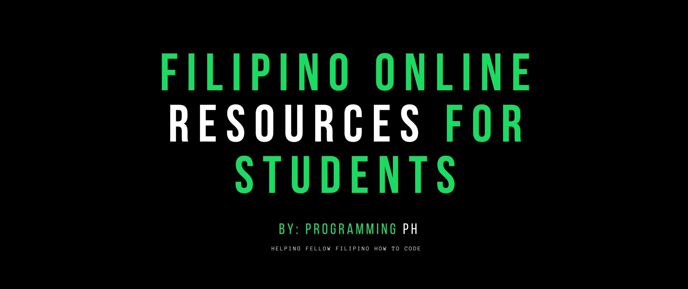

# Mga collection ng English, Tagalog at Bisaya Online Video Resources, Tutorials at iba pa para sa mga Filipino Students and aspiring programmers

## 2026 Update
This repository was updated in 2026 with refreshed tools, AI resources, roadmaps, certifications, and Filipino community links.

If you are a college CS/IT student learning programming or an experienced developer who needs additional resources, we prepared a carefully curated list of tutorials to help each other.

# Table of Contents

1. [Coding Resources](#1-coding-resources)
   1. [Computer Science Fundamentals](#i-computer-science-fundamentals)
   2. [Web Development](#web-development)
   3. [Mobile App Development](#mobile-app-development)
   4. [Data Science](#data-science)
   5. [Machine Learning](#machine-learning)
   6. [Programming Language](#programming-language)
   7. [Programming Skillset](#programming-skillset)
2. [Online Filipino Coding Community](#2-online-filipino-coding-community)
   1. [Facebook Programming Community Groups and Pages](#facebook-programming-community-groups-and-page)
   2. [Other Filipino Communities and Tech Organizations](#other-filipino-communities-and-tech-organizations-updated)
   3. [Filipino Programmers on YouTube](#filipino-programmers-on-youtube)
3. [Free Book Library](#3-free-book-library)
4. [Career and Job Resources](#4-career-and-job-resources)
5. [Support Programming PH](#support-programming-ph)

---

## FYI -- Icon Indicator

- 👶 - It highlights resources for absolute beginners.
- 🏫 - Highly recommended for college students.
- 🇵🇭 - It highlights resources coming from Filipino developers.
- ⭐ - Some resources are recommended for everyone.
- 💲 - Resources that aren't free.
- 🤖 - AI-assisted tools and platforms.

---

# 1. Coding Resources

## i. Computer Science Fundamentals
This provides various topics for a complete beginners. Ideal for students who just started learning about programming.

### a. Computer Basic (Absolute Beginners)

- [How the Internet Works in 5 Minutes - YouTube](https://www.youtube.com/watch?v=7_LPdttKXPc)
- What is computer?
- Improve your typing speed by playing **[type racer game](https://play.typeracer.com)**.
- What is a Operating System?
- Computer Terminology

### b. Programming Basic

- [Programming Fundamentals](https://www.youtube.com/watch?v=ORm3CexT3wE&list=PLVnJhHoKgEmo27CVYZulSIbSaYDpEpzbg) - A Tagalog video tutorial playlist by SDPT Solutions. 🇵🇭 👶 🏫
- What is programming syntax?
- What is pseudocode?
- What is a flow-chart?
- What is a programming language?
- Binary numbers
- What is IDE?
- Difference between BS-IT and BS-CS?

## Web Development

### Front-End

- [HTML and CSS Tutorials | w3schools.com](https://www.w3schools.com/html/default.asp) 👶
- Learn free bootcamp in [freeCodeCamp](https://www.freecodecamp.org/) 👶 ⭐
- [HTML & CSS Catalog | Codecademy](https://www.codecademy.com/catalog/language/html-css)
- [HTML MDN Web Docs](https://developer.mozilla.org/en-US/docs/Learn/HTML)
- [CSS MDN Web Docs](https://developer.mozilla.org/en-US/docs/Learn/CSS)
- [The Odin Project](https://www.theodinproject.com/)
- [CSS Grid](https://cssgrid.io/)
- Learn CSS Selector by solving the [CSS diner game](https://flukeout.github.io/) 👶
- Udemy Course: [Advanced CSS and SASS](https://www.udemy.com/advanced-css-and-sass) 💲 *(**Php500**/course)*
- [flexbox cheatsheet](https://darekkay.com/dev/flexbox-cheatsheet.html)
- [Flexbox Froggy | CSS Learning Game](https://flexboxfroggy.com/)
- [CSS Reference: A Visual CSS Cheat Sheet](https://cssreference.io/) 👶
- [HTML Reference: A Visual HTML Cheat Sheet](https://htmlreference.io/) 👶

### Back-End

- [Node.js Learn](https://nodejs.org/en/learn) - Official Node.js learning resources. 👶
- [Express.js Guide](https://expressjs.com/en/guide/routing.html) - Beginner-friendly backend routing guide. 👶
- [Django Tutorial](https://docs.djangoproject.com/en/stable/intro/tutorial01/) - Build full backend apps in Python. 👶
- [FastAPI Tutorial](https://fastapi.tiangolo.com/tutorial/) - Modern Python API framework docs. 👶
- [Laravel Documentation](https://laravel.com/docs) - Popular PHP backend framework docs.
- [NestJS Documentation](https://docs.nestjs.com/) - Scalable Node.js backend framework.

### Full-stack
- [Online Resource for Web Developers](https://github.com/YankoFutekov/OnlineResourcesForWebDevelopers)
- [The Odin Project - Full Stack JavaScript](https://www.theodinproject.com/paths/full-stack-javascript) 👶 🏫
- [Full Stack Open](https://fullstackopen.com/en/) - Modern React + Node + GraphQL course. 🏫
- [CS50's Web Programming with Python and JavaScript](https://cs50.harvard.edu/web/) 🏫 ⭐

## Mobile App Development

### Android

- [Android Developers Training](https://developer.android.com/courses) - Official Android learning tracks. 👶
- [Android Basics with Compose](https://developer.android.com/courses/android-basics-compose/course) - Beginner Android path. 👶
- [Kotlin for Android Developers](https://kotlinlang.org/docs/android-overview.html) - Kotlin resources for Android development.

### iOS

- [Apple Developer Tutorials (SwiftUI)](https://developer.apple.com/tutorials/swiftui) - Official iOS and SwiftUI tutorials.
- [Develop in Swift Tutorials](https://developer.apple.com/tutorials/develop-in-swift) - Beginner-friendly Swift resources. 👶
- [Hacking with Swift - 100 Days of SwiftUI](https://www.hackingwithswift.com/100/swiftui) - Free structured iOS learning plan. 👶

### Flutter
Build cross platform mobile app using Flutter. With flutter you can write in a single code-base (Dart Programming language) and deploy both iOS and Android app.

- [Official Flutter Website](https://flutter.dev/)
- [Flutter Sample apps library](https://github.com/flutter/samples)
- [Build Native Mobile Apps with Flutter](https://www.udacity.com/course/build-native-mobile-apps-with-flutter--ud905)

## Data Science

- [Kaggle Learn](https://www.kaggle.com/learn) - Free micro-courses for data science. 👶
- [Google Machine Learning Crash Course](https://developers.google.com/machine-learning/crash-course) 👶 ⭐
- [Pandas User Guide](https://pandas.pydata.org/docs/user_guide/index.html)
- [NumPy User Guide](https://numpy.org/doc/stable/user/index.html)
- [DataTalks.Club](https://datatalks.club/) - Free cohorts and data projects.

## Machine Learning

- [Machine Learning Specialization (Andrew Ng)](https://www.coursera.org/specializations/machine-learning-introduction) 🏫 ⭐
- [fast.ai - Practical Deep Learning](https://course.fast.ai/)
- [Hugging Face Course](https://huggingface.co/learn)
- [DeepLearning.AI Short Courses](https://www.deeplearning.ai/short-courses/)
- [Learn Deep Learning in 6 weeks](https://github.com/llSourcell/Learn_Deep_Learning_in_6_Weeks/)

## Programming Language

### Javascript/NodeJs

- [NodeJs Boilerplate](https://github.com/Programming-PH/nodejs-boilerplate) - Kickstart your NodeJs script project by using a boilerplate.
- [Learn Javascript in 1 HOUR](https://www.youtube.com/watch?v=W6NZfCO5SIk) - Video Tutorial by Mosh. ⭐
- [Javascript in 3hrs](https://www.youtube.com/watch?v=PkZNo7MFNFg) - 3 hrs Video Tutorial by Freecodecamp.
- [Introduction to Javascript](https://www.codecademy.com/learn/introduction-to-javascript) - a 30 hrs course bootcamp prepared by [Codeacademy](https://www.codecademy.com). 👶
- [10 Things you shouldn't do while running NodeJs in Production](https://hashnode.com/post/10-things-you-shouldnt-do-while-running-nodejs-in-production-cisab2fyu0s9oth5341faywcw). ⭐

### Python

- [Python Tutorial (Latest)](https://docs.python.org/3/tutorial/index.html) - Official Python tutorial. 👶
- [Python Glossary](https://docs.python.org/3/glossary.html#glossary) - List of Python terminology.
- [Automate the Boring Stuff with Python](https://automatetheboringstuff.com/) 👶 ⭐
- [Real Python](https://realpython.com/) - Practical Python articles and tutorials.

### Java

- [Java Tutorials](https://docs.oracle.com/javase/tutorial/) - Core Java fundamentals.
- [Java Documentation](https://docs.oracle.com/en/java/) - Official Java reference docs.
- [Hyperskill Java Developer](https://hyperskill.org/tracks/8) - Project-based Java track.

### PHP

- [PHP Manual](https://www.php.net/manual/en/) - Official PHP documentation.
- [Laracasts - PHP for Beginners](https://laracasts.com/series/php-for-beginners-2023-edition) - Practical PHP basics.
- [PHP The Right Way](https://phptherightway.com/) - Best practices for modern PHP.

### C++

- [LearnCpp](https://www.learncpp.com/) - Comprehensive free C++ tutorial.
- [C++ Reference](https://en.cppreference.com/w/) - Language and standard library reference.
- [C++ Core Guidelines](https://isocpp.github.io/CppCoreGuidelines/CppCoreGuidelines) - Recommended best practices.

### Ruby

- [Ruby in Twenty Minutes](https://www.ruby-lang.org/en/documentation/quickstart/) - Fast Ruby intro.
- [The Odin Project - Ruby Course](https://www.theodinproject.com/paths/full-stack-ruby-on-rails/courses/ruby)
- [Ruby Documentation](https://docs.ruby-lang.org/en/) - Official Ruby docs.

### Dart/Flutter

- [Dart Language Tour](https://dart.dev/language) - Learn Dart syntax and core features.
- [Dart Codelabs](https://dart.dev/codelabs) - Hands-on Dart practice.
- [Flutter Codelabs](https://docs.flutter.dev/codelabs) - Guided Flutter app building exercises.

## Programming Skillset

### Git

- [Using Git on GitHub Docs](https://docs.github.com/en/get-started/using-git) - Common and advanced Git workflows.
- [Terminal Cheat sheet](https://gist.github.com/cferdinandi/ef665330286fd5d7127d) - Learning the terminal commands for Git from basic to advance.
- [Git-flow Cheat sheet](https://danielkummer.github.io/git-flow-cheatsheet/) - Efficient branching with git-flow.

### Programming Useful Tools (Updated)

- [Visual Studio Code](https://code.visualstudio.com/) - Most-used code editor for students and professionals. ⭐
- [GitHub Desktop](https://desktop.github.com/) - Beginner-friendly Git client.
- [Postman](https://www.postman.com/) - API testing and collaboration.
- [Bruno](https://www.usebruno.com/) - Offline-first API client.
- [Docker](https://www.docker.com/get-started/) - Containerize apps for consistent environments.
- [Vercel](https://vercel.com/) and [Netlify](https://www.netlify.com/) - Easy frontend deployment.
- [Render](https://render.com/) and [Railway](https://railway.com/) - Beginner-friendly backend deployment.
- [GitHub Student Developer Pack](https://education.github.com/pack) 🏫 ⭐

### AI Tools for Learning and Coding

- [ChatGPT](https://chatgpt.com/) - Explain concepts, debug errors, and generate starter code. 🤖 👶
- [GitHub Copilot](https://github.com/features/copilot) - AI pair programmer inside your IDE. 🤖 💲
- [Gemini](https://gemini.google.com/) - Research, planning, and coding support. 🤖 👶
- [Claude](https://claude.ai/) - Long-form reasoning and code review help. 🤖
- [Perplexity](https://www.perplexity.ai/) - AI-assisted search with citations. 🤖 👶
- [Cursor](https://www.cursor.com/) - AI-first code editor. 🤖 💲
- [Continue](https://www.continue.dev/) - Open-source AI coding assistant for VS Code/JetBrains. 🤖 ⭐

> Tip: Use AI as a tutor and code reviewer, not a copy-paste replacement. Always test and understand generated code.

### Free Online Courses and Certifications

#### Free Online Courses

- [freeCodeCamp](https://www.freecodecamp.org/learn/) - Full beginner tracks for web development, Python, and data. 👶 🏫 ⭐
- [CS50x](https://cs50.harvard.edu/x/) - Free Harvard intro to computer science. 🏫 ⭐
- [The Odin Project](https://www.theodinproject.com/) - Free full-stack web curriculum. 👶 🏫
- [Full Stack Open](https://fullstackopen.com/en/) - Free modern full-stack curriculum. 🏫
- [Kaggle Learn](https://www.kaggle.com/learn) - Free data science and ML micro-courses. 👶
- [Google Machine Learning Crash Course](https://developers.google.com/machine-learning/crash-course) - Free ML fundamentals. 👶 ⭐
- [MIT OpenCourseWare](https://ocw.mit.edu/) - Free university-level CS and IT courses. 🏫 ⭐

#### Free Certification Resources

- [freeCodeCamp Certifications](https://www.freecodecamp.org/learn/) - Free certificates after finishing each track. 🏫 ⭐
- [Cisco Skills for All](https://www.netacad.com/courses/all-courses) - Free courses with completion badges/certificates. 🏫
- [AWS Educate](https://aws.amazon.com/education/awseducate/) - Free beginner cloud learning path for students. 🏫
- [Microsoft Learn](https://learn.microsoft.com/training/) - Free learning paths with achievements and exam prep. 🏫 ⭐
- [Google Cloud Skills Boost](https://www.cloudskillsboost.google/) - Free learning content and occasional free lab credits. 🏫
- [HackerRank Skills Certification](https://www.hackerrank.com/skills-verification) - Free coding skill certificates. ⭐
- [SoloLearn](https://www.sololearn.com/) - Free coding lessons and certificates of completion. 👶

### Skillset Roadmaps (Beginner to Job-Ready)

Use these roadmaps as your step-by-step guide per career track.

- [Front-End Developer Roadmap](https://roadmap.sh/frontend) - HTML, CSS, JavaScript, React, testing, and deployment. 🏫 ⭐
- [Back-End Developer Roadmap](https://roadmap.sh/backend) - APIs, databases, auth, caching, and backend architecture. 🏫 ⭐
- [Full-Stack Developer Roadmap](https://roadmap.sh/full-stack) - Combine frontend + backend + deployment workflows. 🏫 ⭐
- [DevOps Roadmap](https://roadmap.sh/devops) - CI/CD, containers, cloud, infrastructure, and monitoring. 🏫 ⭐
- [Cyber Security Roadmap](https://roadmap.sh/cyber-security) - Security fundamentals, defense, and security tools. 🏫 ⭐
- [Data Analyst Roadmap](https://roadmap.sh/data-analyst) - SQL, spreadsheets, BI tools, and analytics workflows. 🏫 ⭐
- [AI and Data Scientist Roadmap](https://roadmap.sh/ai-data-scientist) - Python, ML, model training, and MLOps basics. 🏫 ⭐ 🤖
- [Android Roadmap](https://roadmap.sh/android) - Kotlin, Android fundamentals, app architecture, and publishing. 🏫 ⭐
- [Software Architect Roadmap](https://roadmap.sh/software-architect) - System design, scalability, and architecture decisions. ⭐
- [Computer Science Roadmap](https://roadmap.sh/computer-science) - Core CS topics for long-term growth. 🏫 ⭐

For infrastructure-focused tracks:

- [Network Engineer Roadmap](https://roadmap.sh/devops) - Start with Linux, TCP/IP, DNS, routing/switching, then cloud networking. 🏫
- [System Administrator Roadmap](https://roadmap.sh/devops) - Focus on Linux administration, scripting, automation, security hardening, and monitoring. 🏫

#### Suggested 6-12 Month Learning Sequence Per Track

Use this format for each track:
- `Phase 1 (Month 1-2):` Fundamentals
- `Phase 2 (Month 3-5):` Core tools and guided projects
- `Phase 3 (Month 6-8):` Portfolio projects and deployment
- `Phase 4 (Month 9-12):` Interview prep, certifications, and internships/jobs

##### 1) Front-End Developer

- Month 1-2: HTML, CSS, JavaScript basics, Git/GitHub.
- Month 3-5: Responsive design, React, API integration, testing basics.
- Month 6-8: Build and deploy 3 portfolio projects (landing page, dashboard, e-commerce UI).
- Month 9-12: DSA basics, frontend interview prep, apply to internships/junior roles.

##### 2) Back-End Developer

- Month 1-2: One backend language (Node.js/Python/PHP), HTTP, REST basics, SQL basics.
- Month 3-5: Framework (Express/FastAPI/Django/Laravel), authentication, database design.
- Month 6-8: Build 2-3 APIs (auth service, CRUD app, file upload), deploy with Docker.
- Month 9-12: System design basics, testing, security practices, internship/job applications.

##### 3) Full-Stack Developer

- Month 1-2: HTML/CSS/JS + backend basics + Git workflow.
- Month 3-5: React/Vue + Node/FastAPI + PostgreSQL + authentication.
- Month 6-8: Build end-to-end capstone apps and deploy (frontend + backend + DB).
- Month 9-12: Optimize performance, CI/CD basics, prepare portfolio and resume.

##### 4) Network Engineer

- Month 1-2: Networking fundamentals (OSI/TCP-IP, subnetting, DNS, DHCP).
- Month 3-5: Routing/switching labs, firewall basics, Linux networking tools.
- Month 6-8: Cloud networking (AWS/Azure/GCP VPC concepts), monitoring and troubleshooting.
- Month 9-12: Prepare for entry-level certs (CCNA/Network+) and apply for NOC/network roles.

##### 5) System Administrator (SysAdmin)

- Month 1-2: Linux fundamentals, shell commands, user/process/file management.
- Month 3-5: Bash/Python scripting, package/service management, backups.
- Month 6-8: Automation (Ansible), monitoring, logging, hardening and access control.
- Month 9-12: Cloud VM administration, incident response basics, cert/job prep.

##### 6) DevOps Engineer

- Month 1-2: Linux, Git, networking and scripting fundamentals.
- Month 3-5: Docker, CI/CD pipelines (GitHub Actions/GitLab CI), IaC basics.
- Month 6-8: Kubernetes basics, observability (logs/metrics/traces), cloud deployment.
- Month 9-12: Build production-style pipeline project, interview prep, apply for junior DevOps/SRE roles.

##### 7) Cyber Security

- Month 1-2: Security fundamentals, Linux/network basics, threat concepts.
- Month 3-5: Security tools (Wireshark, SIEM basics), vulnerability scanning, web security basics.
- Month 6-8: Blue-team labs, incident handling workflow, secure coding practices.
- Month 9-12: Entry cert prep (Security+/eJPT paths), CTF participation, SOC analyst applications.

##### 8) Data Analyst

- Month 1-2: Excel/Sheets, SQL basics, descriptive statistics.
- Month 3-5: Data cleaning, visualization (Power BI/Tableau), business reporting.
- Month 6-8: End-to-end analytics projects with dashboards and written insights.
- Month 9-12: Case interview prep, portfolio polishing, apply for analyst internships/jobs.

##### 9) AI / Data Scientist

- Month 1-2: Python, NumPy, Pandas, statistics and probability foundations.
- Month 3-5: Machine learning fundamentals (supervised/unsupervised), model evaluation.
- Month 6-8: Deep learning basics, NLP/computer vision starter projects.
- Month 9-12: Capstone project with deployment, write technical case study, apply for junior ML/data roles.

##### 10) Android Developer

- Month 1-2: Kotlin basics, Android Studio, activity lifecycle, layouts.
- Month 3-5: Jetpack components, local storage, REST API integration.
- Month 6-8: Build and publish portfolio apps (notes app, e-commerce, chat prototype).
- Month 9-12: App optimization/testing, play store readiness, junior mobile dev applications.

# 2. Online Filipino Coding Community

## Facebook Programming Community Groups and Page

- [Programming PH](https://www.facebook.com/ProgrammingPH/) Page *(New)* 🇵🇭
 - [Philippine Group of Web Developers](https://www.facebook.com/groups/pg.webdev/)
 - [FreeCodeCamp Manila](https://www.facebook.com/freeCodeCamp.Manila/) - FCC Community Group Manila.
 - [FreeCodeCamp Cebu](https://www.facebook.com/groups/free.code.camp.cebu/) - FCC Bootcamp Community Group in Cebu.
 - [Programmers,Developers](https://www.facebook.com/groups/ProgramersDevelopers/)
 - [Cebu Web Developer Community](https://www.facebook.com/groups/196767804245829/)
 - [Node.JS PH (Pinoy JS Devs)](https://www.facebook.com/groups/NodeJS.PHDevs/)
 - [Philippine Android Developers Community](https://www.facebook.com/groups/padc.you)
 - [Python Philippines (PythonPH) Community](https://www.facebook.com/groups/pythonph)
 - [IT Professionals PH](https://www.facebook.com/groups/762720073916341/)
 - [Cebu Web Designers and Developers](https://www.facebook.com/groups/cebuwebdesignersdevs/)
 - [AWS User Group Philippines](https://www.facebook.com/groups/AWSUGPH/)
 - [ReactJS Philippines](https://www.facebook.com/reactjsphilippines/)
 - [Antares Programming](https://facebook.com/antaresprogramming) - easy-to-digest HTML/CSS infographics in Tagalog 

## Other Filipino Communities and Tech Organizations (Updated)

- [DEVCON Philippines](https://devcon.ph/) - Largest volunteer tech community in the Philippines. 🇵🇭 🏫
- [Campus DEVCON](https://devcon.ph/campus/) - Student-focused programs, talks, and summits. 🇵🇭 🏫
- [Python Philippines (PythonPH)](https://python.ph/) - Python community, PyCon PH, and activities. 🇵🇭
- [Google Developer Groups Manila](https://gdg.community.dev/gdg-manila/) - Google tech talks, workshops, and events. 🇵🇭
- [GDG Cloud Manila](https://gdg.community.dev/gdg-cloud-manila/) - Cloud and AI focused meetups. 🇵🇭 🤖
- [AWS User Group - MegaManila & Philippines](https://www.meetup.com/aws-user-group-philippines/) - AWS community events. 🇵🇭
- [AWS User Group Davao](https://awsugdavao.ph/) - Mindanao-based AWS community. 🇵🇭
- [MongoDB User Group Manila](https://www.meetup.com/mongodb-usergroup-manila/) - Database-focused tech meetups. 🇵🇭

## Filipino Programmers on YouTube

- **[Programming PH](https://www.youtube.com/channel/UCzuOQurgDZCdHUFBwL6Oexg)**  - General advice, programming tips, tricks, and tutorials in Tagalog. Founded by [Jorge](https://github.com/jorgerosal). 🇵🇭 👶
- **[SDPT Solutions](https://www.youtube.com/channel/UCMDL68xgNqRqzin1rkh9WuQ)** - Tagalog tutorials for beginners. 🇵🇭 👶
- **[John Carlo Franco](https://www.youtube.com/channel/UCRfO9oznydRShqHUXeO8kaw)** - [John](https://github.com/francojohnc) makes videos focused on programming tips and advice in Tagalog.
- **[Rem Lampa](https://www.youtube.com/channel/UC3khUmB7mxpkrF1GjKjpa7A)** - FreeCodeCamp Manila Community Leader. [Rem](https://github.com/RemLampa) is doing live discussion on IT related stuff on his channel.
- **[PinoyFreeCoder](https://www.youtube.com/channel/UCFpZDxOMGzsx05epqfvmzbQ)** - Tutorials in Tagalog language. 🇵🇭 👶
- **[Dev Avenue](https://www.youtube.com/channel/UCltYKjGdnCQx_-5qIt7dUCA)**
- **[Pinoydatascientist](https://www.youtube.com/channel/UCTqbbm0ZhIZ0ya4TOUnH4ag)** - data science topics.

# 3. Free Book Library

## Our Shared Dropbox Folder

- Click [here](https://www.dropbox.com/sh/7bctdxlyq2hvus5/AADZ456-rS1GzOdhpkQCTyzpa?dl=0) to access dropbox link to books in view mode. If you want full access to the folder, please send us a request with your email address.
- Want to contribute ebooks? [Upload](https://www.dropbox.com/request/ketm016DRCFLvkKeX3MP) it into our shared dropbox folder. Click [here](https://www.dropbox.com/request/ketm016DRCFLvkKeX3MP) to upload.

## Other Library
- [Free for Dev Services](https://free-for.dev/#/)
- [Free programming books github repo](https://github.com/EbookFoundation/free-programming-books) - Largest maintained free books repository. Multilanguage.
- [roadmap.sh](https://roadmap.sh/) - Role-based learning roadmaps for developers.
- [OSSU Computer Science](https://github.com/ossu/computer-science) - Free self-taught CS curriculum.
- [CS50x](https://cs50.harvard.edu/x/) - Strong CS foundation for beginners.

# 4. Career and Job Resources

## Job Boards and Internships

- [Kalibrr](https://www.kalibrr.com/) - Popular PH platform for entry-level and internship roles. 🇵🇭
- [JobStreet Philippines](https://www.jobstreet.com.ph/) - Local hiring platform for IT and software jobs. 🇵🇭
- [LinkedIn Jobs](https://www.linkedin.com/jobs/) - Global and local tech job listings.
- [Indeed Philippines](https://ph.indeed.com/) - General PH job board with developer roles.
- [Bossjob](https://bossjob.ph/) - Jobs from startups and local tech companies.

## Remote Job Platforms

- [Wellfound (AngelList Talent)](https://wellfound.com/jobs) - Startup and remote opportunities.
- [We Work Remotely](https://weworkremotely.com/) - Curated remote jobs.
- [Remote OK](https://remoteok.com/) - Remote engineering and product roles.

## Resume, Portfolio, and Interview Prep

- [resume.io](https://resume.io/) - Resume templates and examples.
- [Canva Resume Builder](https://www.canva.com/resumes/templates/) - Free resume templates.
- [Frontend Mentor](https://www.frontendmentor.io/) - Practice projects for frontend portfolio. ⭐
- [Exercism](https://exercism.org/) - Coding practice with mentor feedback. ⭐
- [LeetCode](https://leetcode.com/) - Coding interview practice. ⭐
- [InterviewBit](https://www.interviewbit.com/) - Structured interview prep.
- [Pramp](https://www.pramp.com/) - Peer-to-peer mock interviews.

# Support Programming PH

## Contribute

We are at the very early stage of this repository. Any help and contribution is welcome.
- Please read how to contribute [here](CONTRIBUTING.md)
- Our [contributors](https://github.com/Programming-PH/filipino-online-resources-for-students/graphs/contributors).

## Share the love

Love only grows by sharing. You can only have more for yourself by giving it away to others. Show us some love by giving this repository a ⭐. Share it others. It's a win-win for both of us. :)
